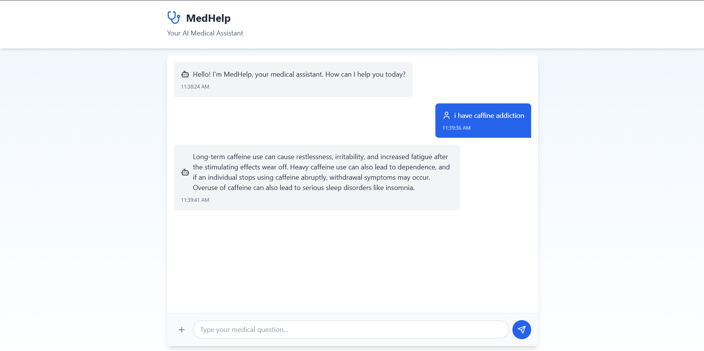
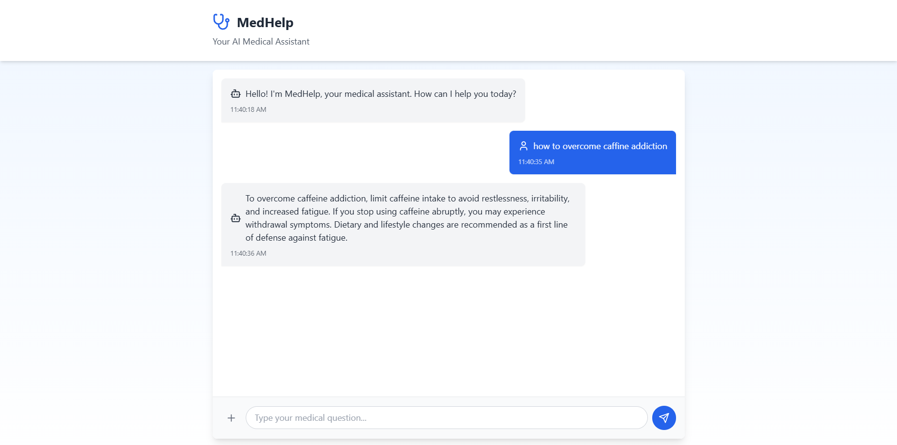

# MedHelp - AI Medical Assistant

## Overview
MedHelp is an end-to-end AI-powered medical assistant that provides quick and accurate responses to medical queries. The system uses advanced language models and vector search to process medical information and provide relevant answers.

## UI Screenshots
Here are some screenshots of the MedHelp interface in action:

### Chat Interface

*Main chat interface showing the conversation with the AI medical assistant*

### Response Example

*Example of AI-generated medical information response*

## Tech Stack
- **Backend**: Python, Flask
- **Frontend**: React, TypeScript, TailwindCSS
- **AI/ML**: 
  - LangChain
  - Google Gemini AI
  - Hugging Face Embeddings
  - Pinecone Vector Database
- **UI Components**: 
  - Framer Motion (animations)
  - GSAP (animations)
  - Lucide React (icons)

## Project Structure
```
MedHelp-end-to-end/
├── app.py                 # Flask backend server
├── Frontend/             # React frontend application
│   ├── src/
│   │   ├── App.tsx      # Main application component
│   │   ├── main.tsx     # Application entry point
│   │   └── index.css    # Global styles
├── src/                  # Backend source code
│   ├── helper.py        # Utility functions for PDF processing
│   └── prompt.py        # System prompts for AI
├── research/            
│   └── trails.ipynb     # Research and development notebook
├── store_index.py       # Script to store documents in Pinecone
├── template.py          # Project structure template
├── setup.py            # Python package setup
└── requirements.txt     # Python dependencies
```

## Features
1. **PDF Document Processing**
   - Loads medical documents from PDF files
   - Splits text into manageable chunks
   - Generates embeddings using Hugging Face models

2. **Vector Search**
   - Uses Pinecone for efficient vector storage and retrieval
   - Semantic search capabilities for finding relevant medical information

3. **AI-Powered Responses**
   - Integrates with Google Gemini AI for natural language processing
   - Contextual response generation using retrieved information
   - Concise three-sentence maximum responses

4. **Modern Web Interface**
   - Responsive design with TailwindCSS
   - Smooth animations using Framer Motion and GSAP
   - Real-time chat interface
   - Loading states and error handling

## Setup and Installation

### Prerequisites
- Python 3.10+
- Node.js and npm
- Pinecone API key
- Google Gemini API key

### Backend Setup
1. Clone the repository:
```bash
git clone <repository-url>
cd MedHelp-end-to-end
```

2. Create a virtual environment:
```bash
python -m venv .venv
source .venv/bin/activate  # On Windows: .venv\Scripts\activate
```

3. Install dependencies:
```bash
pip install -r requirements.txt
```

4. Create a .env file with your API keys:
```
PINECONE_API_KEY=your_pinecone_key
GEMINI_API_KEY=your_gemini_key
```

5. Run the Flask server:
```bash
python app.py
```

### Frontend Setup
1. Navigate to the Frontend directory:
```bash
cd Frontend
```

2. Install dependencies:
```bash
npm install
```

3. Start the development server:
```bash
npm run dev
```

## Usage
1. Place your medical PDF documents in the `Data/` directory
2. Run `store_index.py` to process documents and store them in Pinecone
3. Start the backend server
4. Start the frontend application
5. Access the application through your web browser

## Key Components

### Backend Components

1. **app.py**
- Flask server setup with CORS support
- Endpoint for processing chat messages
- Integration with LangChain and Gemini AI

2. **helper.py**
- PDF document loading and processing
- Text chunking functionality
- Hugging Face embeddings generation

3. **prompt.py**
- System prompt template for AI responses
- Response formatting guidelines

### Frontend Components

1. **App.tsx**
- Main chat interface
- Real-time message handling
- Animated UI components
- Error handling and loading states

## Security Considerations
- API keys are stored in environment variables
- CORS is enabled for secure cross-origin requests
- Input validation and sanitization
- Error handling for API failures

## Limitations and Disclaimers
- The system provides general medical information only
- Not a replacement for professional medical advice
- Response quality depends on the provided medical documents
- May have limitations in handling complex medical queries

## Development and Contribution
1. Fork the repository
2. Create a feature branch
3. Make your changes
4. Submit a pull request

## License
[Add your license information here]

## Author
Ishpreet Singh
Email: ishpreet36752@gmail.com

## Acknowledgments
- LangChain for the document processing pipeline
- Google Gemini AI for natural language processing
- Pinecone for vector storage
- React and TailwindCSS communities for frontend tools